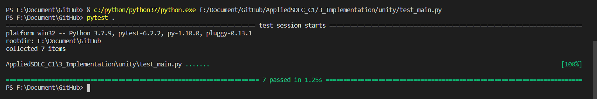
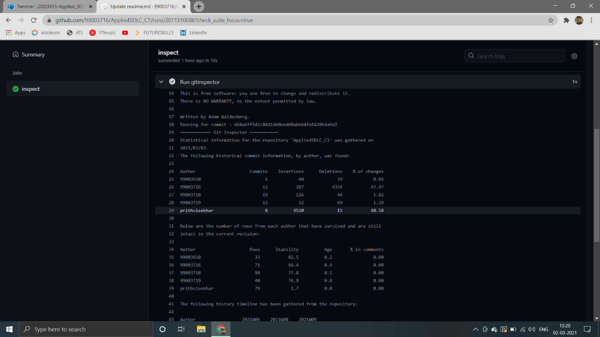

# Team Summary 

|

**PS Number**
|

**Name**
|

**Contribution**
|
**Issues**

**Raised**
|
**Issues**

**Resolved**
|
| :-: | :-: | :- | :-: | :-: |
|

99003716

|

Mithun M R
|
Documentation : High level and low level behavioral Diagrams, Needs

Implementation: Worked on integration, Plotting and implementation of main file, Automatic email sender
|

2

|

2
|
|

99003718

|

Prashant Sudhir Bagal
|
Documentation : High Level and Low level test Plan, Swot Analysis, 4W and 1H

Implementation: Worked on average\_of\_los(), min\_of\_Lo (), max\_of\_LO() functions using pandas & Report of miniproject
|

2
|

2
|
|

99003650

|

Unnati Agrawal
|
Documentation : High level and low level structural Diagrams

Implementation: Worked on sum\_of\_marks(), top\_5\_average(),bottom\_5\_average() functions using pandas, contributed in integration of project, provided required excel files
|

2
|

2
|
|

99003619
|

Aishwarya K H
|
Documentation : High level and low level requirements

Implementation: Worked on plotting of data in form of graph, contributed in main file  
|

2
|

2
|

# Test Summary

|**Name**|**PS Number**|**Test Cases Provided**|**Test Cases Passed**|**Test Cases Failed**|
| :-: | :-: | :-: | :-: | :-: |
|

Mithun M R
|

99003716
|3|3|0|
|

Prashant Sudhir Bagal
|

99003718
|3|3|0|
|

Unnati Agrawal
|

99003650
|3|3|0|
|

Aishwarya K H
|

99003619
|3|3|0|

# Challenges

1\) Importing the coreect format of excel file in python.

2\) Creation of logic in fuctions for data analysis.

3\) Integration of automatic mailing code graph plotting code and
analysis code.

4\) Creating workflow

5\) Making plateform independent workflow

# Pytest

# Git Inspector 

# Learning resources

1\)Resources for Testing, Unit testing, Integration testing 

Type Of Testing:- https://hackr.io/blog/types-of-software-testing

Unit Testing:- https://www.guru99.com/unit-testing-guide.html

Integration Testing:- https://www.guru99.com/integration-testing.html

2\)Resources for UML diagrams

Resources for Structural and behavioural  UML diagram

https://sparxsystems.com/enterprise_architect_user_guide/15.2/model_domains/structuraldiagrams.html

https://www.tutorialspoint.com/uml/uml_standard_diagrams.htm

https://www.visual-paradigm.com/guide/uml-unified-modeling-language/behavior-vs-structural-diagram

3\)Resources for SWOT Analysis

https://www.wordtemplatesonline.net/swot-analysis-template/

https://www.lucidchart.com/pages/swot-analysis-template-word

4\)Resources for Requirement Analysis

 https://www.visual-paradigm.com/guide/requirements-gathering/requirement-analysis-techniques/ 

https://www.guru99.com/learn-software-requirements-analysis-with-case-study.html

# **Theme  :** 

Analysis of data of  students’ presurvey , postsurvey and pre test , post test

## **Epic :**

1.Importing data from excel sheets , calculating statistics using pandas.

` `**User Stories :**

    1. Reading the files using pandas

    Unnati (PS No. 99003650) created required excel files & with Prashant (PS No. 99003718) & Aishwarya (PS No. 99003719) 
    she wrote all the functions required to take inputs from excel files 

2.Plotting bar chart of analysed data.

  **User Stories :**

    Prashant (PS No. 99003718) & Mithun (PS No. 99003716) wrote functions to plot graphs

    Aishwarya (PS No. 99003719) wrote functions to integrate them.

3.Sending the plotted charts using automatic email scripting.

  **User Stories :**

    Mithun (PS No. 99003716) wrote code for automatic email Scripting.

4.Integrating all the functions
  
 **User Stories :**

    Unnati (PS No. 99003650) & Mithun (PS No. 99003716) integrated all the functions

